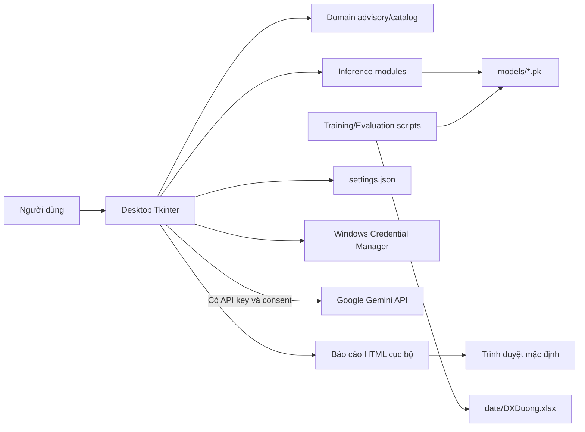
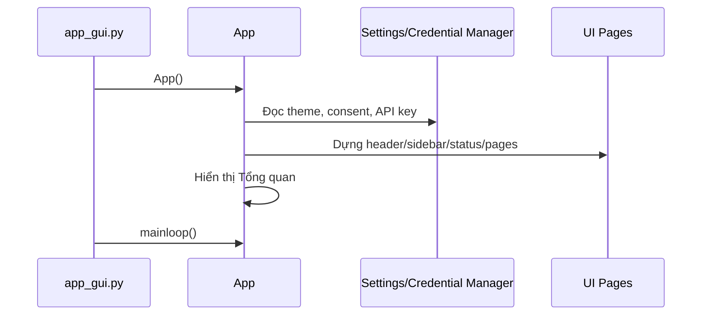

# Kiến trúc hệ thống

## 1. Tổng quan

Hệ thống sử dụng kiến trúc desktop nguyên khối theo lớp logic. `apps/desktop/app.py` vừa dựng giao diện, giữ trạng thái màn hình, xác thực input, điều phối inference, xuất báo cáo và tích hợp dịch vụ Gemini. Nghiệp vụ dùng lại được tách một phần sang `huit_career_advisor/domain`, còn dự đoán ML nằm trong `huit_career_advisor/inference`.

## 2. Sơ đồ ngữ cảnh



## 3. Đối chiếu Frontend, Backend, Database và API

| Khái niệm | Thành phần thực tế |
|---|---|
| Frontend | Giao diện native Tkinter trong `apps/desktop/app.py` |
| Backend | Không có backend server; domain và inference chạy ngay trong tiến trình desktop |
| Database | Không có DBMS; dữ liệu huấn luyện nằm trong Excel, model trong `.pkl`, cấu hình trong JSON |
| Internal API | Các hàm Python như `goi_y_nganh_simple`, `predict_nganh`, `rank_admission_methods` |
| External API | Google Gemini `generateContent` qua HTTPS |
| Web frontend | Không tồn tại |

## 4. Các thành phần chính

### 4.1 Entry point và runtime

- `app_gui.py` import `App` và gọi `App().mainloop()`.
- `_runtime_hook.py` đổi working directory về thư mục chứa executable khi chạy bản PyInstaller.
- `huit_career_advisor/paths.py` phân giải đường dẫn theo source hoặc `sys._MEIPASS` khi đã đóng gói.

### 4.2 Presentation layer

`apps/desktop/app.py` cung cấp:

- Widget dùng lại: `RoundedCard`, `SoftDivider`, `IconButton`, `ResultTable`, `MethodTable`, `ScrollablePage`.
- Cửa sổ `App` kích thước mặc định `1360×880`, tối thiểu `1040×740`.
- Header, sidebar thu gọn/mở rộng, status bar và bảy trang chức năng.
- Binding `Ctrl+Shift+T` để đổi light/dark mode.
- Xử lý DPI và title bar riêng trên Windows.

`apps/desktop/theme.py` cung cấp palette sáng/tối, font, spacing, radius, danh sách nhóm ngành và navigation metadata. Font Roboto được đăng ký bằng Windows GDI; thông báo thay đổi font dùng `SendMessageTimeoutW` và fallback `PostMessageW`.

### 4.3 Domain layer

`domain/catalog.py` là danh mục chuẩn trong code:

- Mã ngành và tên ngành.
- Các tổ hợp xét tuyển theo ngành.
- Ánh xạ mã tổ hợp sang ba môn.
- Chín nhóm ngành và alias theo từng phương thức.

`domain/advisory.py` chứa:

- `AdvisoryProfile`: sở thích, nghề gia đình, địa lý, kinh tế địa phương, tính cách và khả năng học xa.
- `profile_adjustment()`: cộng/trừ điểm hỗ trợ có giới hạn.
- `enrich_major_results()`: bổ sung điểm và lý do hỗ trợ vào kết quả model.
- `rank_admission_methods()`: chuẩn hóa điểm đầu vào để xếp hạng phương thức xét tuyển.
- `profile_summary()`: tạo mô tả ngắn của hồ sơ.

### 4.4 Inference layer

| Module | Model | Đầu vào chính | Đầu ra |
|---|---|---|---|
| `inference/dgnl.py` | `dgnl_models.pkl` | Điểm 600–1200, ưu tiên, thứ tự NV, nhóm mong muốn | Danh sách mã/tên ngành và điểm xếp hạng |
| `inference/academic_record.py` | `hocba_models.pkl` | Tổ hợp, ba điểm môn, tổng học bạ, ưu tiên, nhóm mong muốn | Top-K ngành và cờ phù hợp tổ hợp/nhóm |
| `inference/direct_admission.py` | `tt_models.pkl` | Tổng điểm ba năm, điểm Anh, nhóm mong muốn | Top-K ngành |
| `inference/thpt.py` | `pt1_models.pkl` | Ba điểm môn, ưu tiên, NV, tổ hợp, nhóm mong muốn | Top-K ngành |

Các module sử dụng ensemble Random Forest 70% và Gaussian Naive Bayes 30%, sau đó áp dụng quy tắc boost/penalty theo nhóm ngành hoặc tổ hợp.

### 4.5 Training và evaluation

`research/training` đọc các sheet tương ứng trong `DXDuong.xlsx`, chuẩn hóa cột, tạo feature, chia train/test ngẫu nhiên với `random_state=42`, huấn luyện model và ghi payload bằng `joblib.dump`.

`research/evaluation` tính accuracy, precision, recall, F1, confusion matrix và Top-K cho các tỷ lệ train/test 80/20 và 90/10. Kết quả văn bản được lưu cùng thư mục evaluation.

### 4.6 Persistence cục bộ

- Theme, consent và cờ lưu khóa: `%APPDATA%\HUITCareerAdvisor\settings.json`.
- Gemini API key trên Windows: Generic Credential target `HUIT_Career_Advisor_Gemini_Key`.
- Model: `models/*.pkl`.
- Báo cáo: `Desktop\Bao_cao_Huong_nghiep_HUIT.html`.

### 4.7 External service

Khi có API key và consent, ứng dụng gửi một POST request tới:

```text
https://generativelanguage.googleapis.com/v1beta/models/gemini-flash-latest:generateContent
```

Payload gồm system context được ghép trong code, họ tên, phương thức, điểm, nhóm ngành và câu hỏi của học sinh. Timeout request là 10 giây. Nếu thiếu key, từ chối consent hoặc request lỗi, ứng dụng dùng bộ trả lời offline theo từ khóa.

## 5. Luồng xử lý

### 5.1 Khởi động



Các inference module được import ở đầu `app.py`. Module ĐGNL load model ngay khi import; các module khác load model qua hàm/lớp khi được gọi.

### 5.2 Phân tích một phương thức

1. Người dùng chọn trang phương thức.
2. UI đọc và kiểm tra điểm.
3. UI gọi module inference tương ứng.
4. Module load model và tạo feature theo schema trong payload.
5. RF/NB sinh phân phối xác suất lớp.
6. Quy tắc nhóm ngành/tổ hợp điều chỉnh điểm.
7. `enrich_major_results()` bổ sung tín hiệu hồ sơ.
8. Bảng kết quả hiển thị danh sách đã sắp xếp.

### 5.3 Tổng quan hồ sơ

Trang Tổng quan nhận một hoặc nhiều loại điểm. `rank_admission_methods()` xếp hạng mức sẵn sàng theo phương thức. UI gọi từng model tương ứng, điều chỉnh theo readiness và hồ sơ, sau đó gộp theo `ma_nganh`; với cùng một ngành, kết quả có trọng số cao nhất được giữ lại. Tối đa 12 ngành được hiển thị.

### 5.4 Chat

1. Chatbot thu thập tên, phương thức, điểm và nhóm quan tâm bằng state cục bộ.
2. Model tương ứng tạo gợi ý ngành và báo cáo chat.
3. Với câu hỏi tự do:
   - Không có key: trả lời offline.
   - Có key nhưng chưa consent: hiển thị hộp thoại xin đồng ý.
   - Có key và consent: gọi Gemini trên daemon thread.
   - Lỗi mạng/API: thông báo fallback và trả lời offline.

### 5.5 Xuất báo cáo

UI lấy kết quả tổng quan, escape các trường văn bản chính bằng `html.escape`, ghép vào HTML template, ghi một tệp cố định trên Desktop và mở bằng trình duyệt mặc định.

## 6. Payload model

Các file model chính là dictionary joblib chứa model, encoder, mapping và metadata:

| File | Feature schema hiện tại |
|---|---|
| `dgnl_models.pkl` | `Diem_DGNL_Norm`, `Thu_Tu_NV`, `Diem_KV`, `Diem_DT`, `Ty_Le_Chung`, `Year` |
| `hocba_models.pkl` | `Diem_Mon1`, `Diem_Mon2`, `Diem_Mon3`, `Diem_HB_Tinh`, `Nam` |
| `pt1_models.pkl` | `Mon1`, `Mon2`, `Mon3`, `Diem_UT`, `ThuTuNV`, `ToHop_Enc`, `Year`, `Diem_Tong` |
| `tt_models.pkl` | `TB10`, `TB11`, `TBHK1_12`, `TB_total`, `EngAvg`, `UT_DT`, `UT_KV`, `Year` |

## 7. Hạn chế kiến trúc đã xác minh

- `apps/desktop/app.py` đang chứa hơn 4.400 dòng và đảm nhiệm nhiều trách nhiệm.
- Không có dependency injection hoặc service boundary riêng cho Gemini, settings và report export.
- Không có schema/version validation chung trước khi đưa feature vào model.
- Nhiều lỗi inference bị bắt bằng `except Exception` và chuyển thành kết quả rỗng/fallback.
- Cấu hình không có migration/version.
- Build đóng gói cả dataset nghiên cứu vào bản phân phối.
- Revision hiện tại lỗi smoke test vì các biến `profile_*_display` chưa được khởi tạo trong `_init_advisory_profile()`.

