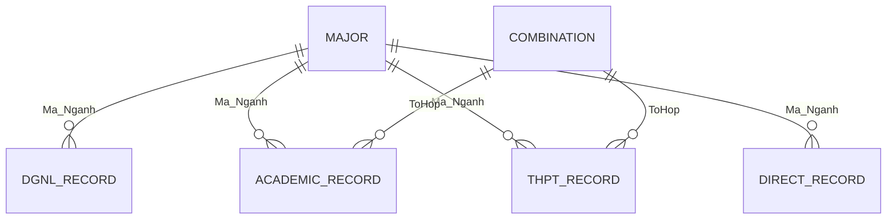

# Tài liệu dữ liệu và lưu trữ

## 1. Kết luận về database

Dự án **không sử dụng hệ quản trị cơ sở dữ liệu**. Không có SQLite, MySQL, PostgreSQL, SQL Server, MongoDB hoặc ORM. Vì vậy không có migration, schema SQL, bảng vật lý, khóa chính/khóa ngoại hay thao tác import database.

Hệ thống dùng bốn loại lưu trữ:

1. Workbook Excel `data/DXDuong.xlsx` cho nghiên cứu và huấn luyện.
2. File joblib/pickle trong `models/` cho inference.
3. JSON trong `%APPDATA%` cho cấu hình.
4. Windows Credential Manager cho Gemini API key.

## 2. Workbook `DXDuong.xlsx`

### 2.1 Danh sách worksheet

Số dòng/cột dưới đây là kích thước worksheet do openpyxl báo cáo, bao gồm dòng tiêu đề và có thể bao gồm dòng rỗng/không hợp lệ. Số bản ghi thực dùng sau tiền xử lý có thể nhỏ hơn.

| Worksheet | Kích thước | Nhóm dữ liệu | Script sử dụng |
|---|---:|---|---|
| `2023-DGNL` | 4.656 × 7 | ĐGNL 2023 | `train_dgnl_models.py` |
| `DGNL-2022` | 9.168 × 11 | ĐGNL 2022 | `train_dgnl_models.py` |
| `DGNL-2021` | 280 × 12 | ĐGNL 2021 | `train_dgnl_models.py` |
| `HB-2023` | 7.482 × 18 | Học bạ 2023 | `train_hocba_models.py` |
| `HB-2022` | 12.551 × 17 | Học bạ 2022 | `train_hocba_models.py` |
| `HB-2021` | 8.025 × 20 | Học bạ 2021 | `train_hocba_models.py` |
| `TT-2023` | 1.825 × 12 | Tuyển thẳng 2023 | `train_tuyenthang_models.py` |
| `TT-2022` | 2.076 × 6 | Tuyển thẳng 2022 | `train_tuyenthang_models.py` |
| `TT-2021` | 620 × 12 | Tuyển thẳng 2021 | `train_tuyenthang_models.py` |
| `All-2023` | 10.147 × 16 | Trúng tuyển tổng hợp 2023 | `train_thpt_models.py` |
| `All-2022` | 6.146 × 16 | Trúng tuyển tổng hợp 2022 | `train_thpt_models.py` |
| `DT-2021` | 7.174 × 14 | Trúng tuyển 2021 | `train_thpt_models.py` |

### 2.2 Các trường dữ liệu logic

#### ĐGNL

- Mã hồ sơ.
- Thứ tự nguyện vọng.
- Mã ngành và tên ngành.
- Điểm thi/tổng điểm.
- Điểm đối tượng, khu vực hoặc điểm chuẩn tùy năm.
- Kết quả.

Feature sau tiền xử lý:

```text
Diem_DGNL_Norm, Thu_Tu_NV, Diem_KV, Diem_DT, Ty_Le_Chung, Year
```

Nhãn: `Ma_Nganh`.

#### Học bạ

- Mã hồ sơ.
- Mã/tên ngành.
- Tổ hợp môn.
- Điểm môn 1, 2, 3 cho lớp 10, lớp 11 và HK1 lớp 12.
- Điểm trung bình/tổng, điểm chuẩn, điểm ưu tiên và kết quả tùy năm.

Feature sau tiền xử lý:

```text
Diem_Mon1, Diem_Mon2, Diem_Mon3, Diem_HB_Tinh, Nam
```

Nhãn: `Ma_Nganh`. Script chỉ giữ bản ghi trúng tuyển theo mapping `KQ_MAP` khi tìm thấy cột kết quả.

#### THPT

- SBD.
- Mã/tên ngành trúng tuyển.
- Mã phương thức và mã tổ hợp.
- Thứ tự nguyện vọng.
- Ba điểm môn.
- Điểm đối tượng/khu vực.
- Điểm trúng tuyển.

Feature sau tiền xử lý:

```text
Mon1, Mon2, Mon3, Diem_UT, ThuTuNV, ToHop_Enc, Year, Diem_Tong
```

Nhãn: `Ma_Nganh`.

#### Tuyển thẳng

- Mã hồ sơ.
- Mã/tên ngành.
- Điểm trung bình lớp 10, lớp 11, HK1 lớp 12.
- Điểm tiếng Anh các năm nếu sheet có dữ liệu.
- Điểm ưu tiên đối tượng/khu vực.
- Tổng điểm và kết quả tùy năm.

Feature sau tiền xử lý:

```text
TB10, TB11, TBHK1_12, TB_total, EngAvg, UT_DT, UT_KV, Year
```

Nhãn: `Ma_Nganh`.

## 3. Quan hệ logic giữa các tập dữ liệu

Không có khóa ngoại được DBMS cưỡng chế. Quan hệ được code suy luận:



- `Ma_Nganh` liên kết bản ghi Excel, label encoder, `name_map` trong model và danh mục `domain/catalog.py`.
- `ToHop`/mã tổ hợp liên kết dữ liệu học bạ/THPT với `ADMISSION_COMBINATIONS` và `MAJOR_ADMISSION_COMBINATIONS`.
- `Year` xác định nguồn dữ liệu theo năm.
- Mã hồ sơ/SBD là định danh trong dữ liệu gốc nhưng không được dùng làm khóa lưu trữ của ứng dụng desktop.

## 4. Model artifacts

### 4.1 Model chính đang được inference sử dụng

| File | Kích thước | Metadata đã đọc từ payload |
|---|---:|---|
| `dgnl_models.pkl` | khoảng 9,3 MB | RF 58,45%; NB 99,67%; 7.687 mẫu; 36 lớp; 6 feature; huấn luyện 21/06/2026 |
| `hocba_models.pkl` | khoảng 96,4 MB | RF 16,26%; NB 4,26%; 15.743 dòng; tạo 19/06/2026 |
| `pt1_models.pkl` | khoảng 3,8 MB | RF 21,14%; NB 6,07%; 18.024 bản ghi |
| `tt_models.pkl` | khoảng 3,0 MB | RF 18,92%; NB 1,55%; 4.518 bản ghi |

Payload thường gồm:

- `rf_model`.
- `nb_model`.
- `le_nganh`.
- `le_tohop` nếu phương thức cần tổ hợp.
- `name_map`.
- `feature_names` hoặc `features`.
- `metadata`.

### 4.2 Artifact cũ/khác

`model_info.pkl`, `naive_bayes_model.pkl`, `random_forest_model.pkl`, `training_summary.pkl` và `nganh_mapping.pkl` vẫn tồn tại. Inference ĐGNL đọc `nganh_mapping.pkl`; các model phương thức mới dùng bốn payload chính ở trên. Không xóa artifact cũ nếu chưa xác minh phụ thuộc của script lịch sử và build.

### 4.3 Cảnh báo an toàn

`joblib.load` có thể thực thi nội dung pickle. Chỉ load model được tạo từ nguồn tin cậy và không cho người dùng tùy ý chọn file `.pkl` bên ngoài.

## 5. Cấu hình người dùng

Đường dẫn:

```text
%APPDATA%\HUITCareerAdvisor\settings.json
```

Các key được source sử dụng:

| Key | Kiểu | Ý nghĩa |
|---|---|---|
| `theme` | string | `light` hoặc `dark` |
| `gemini_api_key_secured` | boolean | Cho biết khóa đã lưu trong Credential Manager |
| `gemini_api_key` | string | Fallback ngoài Windows hoặc khi Credential Manager thất bại |
| `gemini_consent_given` | boolean | Trạng thái đồng ý gửi dữ liệu tới Gemini |

JSON được đọc/ghi toàn bộ bằng UTF-8. Source chưa có schema version hoặc migration.

## 6. Windows Credential Manager

API key được lưu dưới dạng Generic Credential:

| Thuộc tính | Giá trị trong source |
|---|---|
| Target | `HUIT_Career_Advisor_Gemini_Key` |
| Type | `CRED_TYPE_GENERIC` |
| Persist | `CRED_PERSIST_LOCAL_MACHINE` |
| Username | `HUIT_AI_User` |

Source gọi trực tiếp `CredWriteW`, `CredReadW`, `CredDeleteW` qua `ctypes`.

## 7. Báo cáo đầu ra

Báo cáo không được lưu trong database. Mỗi lần xuất, ứng dụng ghi:

```text
%USERPROFILE%\Desktop\Bao_cao_Huong_nghiep_HUIT.html
```

Tên tệp cố định nên lần xuất sau có thể ghi đè lần trước.

## 8. Import dữ liệu

Không có bước import database. Để thay dữ liệu nghiên cứu:

1. Đặt workbook đúng tên `data/DXDuong.xlsx`.
2. Giữ tên worksheet/cột tương thích với script training.
3. Chạy script huấn luyện tương ứng.
4. Kiểm tra metadata và regression test.
5. Build lại ứng dụng để đóng gói model/dataset mới.

Không nên thay workbook production nếu chưa sao lưu và kiểm tra quyền sử dụng dữ liệu.

