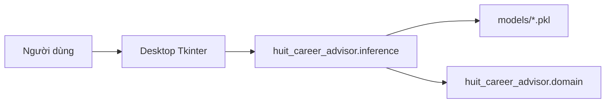

# Mô Hình Hệ Thống Và Luồng Hoạt Động

## Kiến trúc hiện tại

Ứng dụng hiện chỉ có giao diện desktop Tkinter.

## Luồng xử lý

1. Người dùng nhập điểm và hồ sơ tư vấn trên app desktop.
2. Giao diện kiểm tra dữ liệu nhập.
3. Module inference tương ứng đọc model trong `models/`.
4. Kết quả ngành/phương thức được trả về desktop.
5. Desktop hiển thị bảng kết quả, ghi chú và trạng thái phù hợp.

## Các phương thức hỗ trợ

- ĐGNL.
- Học bạ THPT.
- Tuyển thẳng.
- Điểm thi THPT.
- Tổng quan hồ sơ.
- Trợ lý AI hướng nghiệp cục bộ.

## Build

PyInstaller dùng `installer/huit_app.spec` và entrypoint `app_gui.py`.
