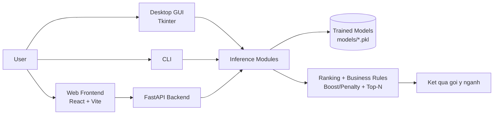
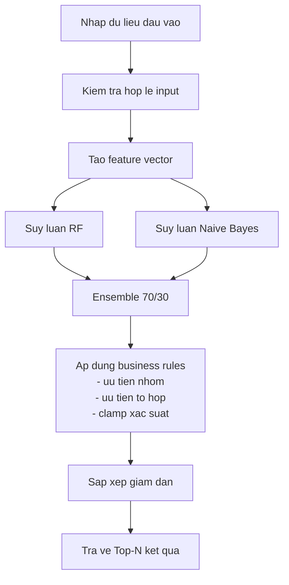
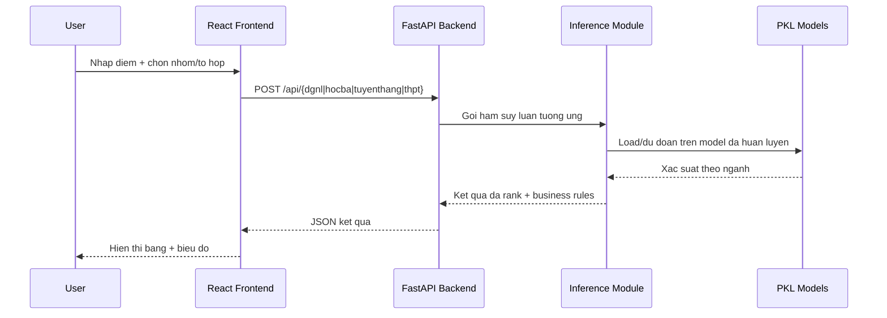
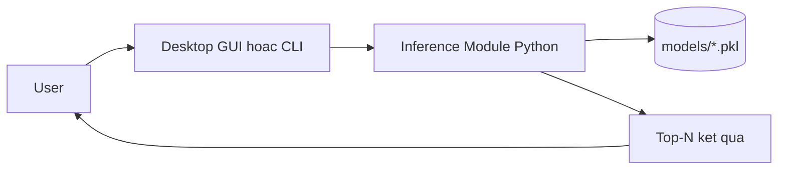

# Mo hinh he thong va so do luong hoat dong

## 1. Mo hinh he thong

He thong goi y huong nghiep HUIT duoc to chuc theo mo hinh da tang (multi-layer):

- Tang giao dien:
  - Desktop GUI: `app_gui.py` (Tkinter)
  - Web Frontend: React + Vite (`frontend/src`)
  - CLI: `main.py`
- Tang API:
  - FastAPI (`backend/main.py`) cung cap cac endpoint du doan cho 4 phuong thuc
- Tang nghiep vu + suy luan:
  - DGNL: `Goi_y_nganh_nghe.py`
  - Hoc ba: `hoc_ba_analyzer.py`
  - Tuyen thang: `Goi_y_nganh_tuyen_thang.py`
  - THPT: `Goi_y_nganh_thpt.py`
- Tang mo hinh:
  - Cac mo hinh da huan luyen duoc luu trong thu muc `models/*.pkl`

### So do tong quan kien truc

## 2. So do luong hoat dong

## 2.0 Tien xu li du lieu (chi tiet)

Tien xu li du lieu trong he thong duoc thuc hien theo 3 lop lien tiep:

- Lop 1 - Frontend/Desktop Input Check:
  - Chuyen doi kieu du lieu nguoi dung nhap (string -> so).
  - Kiem tra du lieu thieu, du lieu khong phai so (NaN) truoc khi gui.
  - Gioi han UI theo range de giam input sai (slider, number min/max, option).
- Lop 2 - API Validation (FastAPI + Pydantic):
  - Rang buoc bien du lieu theo schema (ge/le, min_items/max_items).
  - Tu choi request khong hop le truoc khi vao model.
  - Chuan hoa du lieu payload cho cac ham suy luan.
- Lop 3 - Feature Engineering trong module suy luan:
  - Bien doi input thanh vector dac trung dung voi model da huan luyen.
  - Xu ly gia tri thieu/khong xac dinh bang fallback hop ly.
  - Chuan hoa diem, ma hoa to hop/nganh, va tao cac bien tong hop.

### 2.0.1 Tien xu li cho DGNL

- Input goc:
  - Diem DGNL tong (600-1200), diem uu tien doi tuong, diem uu tien khu vuc, thu tu nguyen vong, nhom ua thich.
- Buoc tien xu li:
  - Kiem tra range diem DGNL (600-1200). Neu sai, dung suy luan va tra thong bao loi.
  - Chuan hoa diem tong ve [0,1] theo cong thuc:
    - diem_tong_norm = (diem_dgnl - 600) / (1200 - 600)
  - Ma hoa ma nganh thanh gia tri so bang LabelEncoder (neu nganh khong nam trong encoder thi fallback ve 0).
  - Tao feature vector day du:
    - [diem_tong_norm, thu_tu_nv, diem_kv, diem_dt, ty_le, ma_nganh_encoded, year]

### 2.0.2 Tien xu li cho Hoc ba

- Input goc:
  - To hop xet tuyen, diem 5 hoc ky cho 3 mon, diem uu tien, nhom ua thich.
- Buoc tien xu li:
  - Kiem tra to hop hop le (nam trong danh muc TO_HOP_MON).
  - Kiem tra moi mon co dung 5 hoc ky.
  - Tinh diem trung binh tung mon:
    - TB_mon = (HK1_L10 + HK2_L10 + HK1_L11 + HK2_L11 + HK1_L12) / 5
  - Tinh diem hoc ba tong (thang 30):
    - diem_hb = TB_mon1 + TB_mon2 + TB_mon3
  - Cong diem uu tien:
    - diem_xet_tuyen = diem_hb + diem_uu_tien
  - Tao vector dac trung de dua vao model:
    - [TB_mon1, TB_mon2, TB_mon3, diem_xet_tuyen, year]

### 2.0.3 Tien xu li cho Tuyen thang

- Input goc:
  - Tong TB 3 nam (thang 30), diem Tieng Anh, nhom ua thich.
- Buoc tien xu li:
  - Kiem tra range input tai API: tb_tong (18-30), diem_anh (0-10).
  - Do khong co diem chi tiet tung nam/tung hoc ky, he thong suy dien:
    - tb_mon = tb_tong / 3
  - Tao mau du lieu suy luan theo cau truc model train:
    - [TB10, TB11, TBHK1_12, TB_total, EngAvg, UT_DT, UT_KV, Year]
  - Gan mac dinh cho bien khong co trong input:
    - UT_DT = 0, UT_KV = 0, Year = 2024

### 2.0.4 Tien xu li cho THPT

- Input goc:
  - Diem 3 mon, diem uu tien, thu tu nguyen vong, ma to hop, nhom ua thich.
- Buoc tien xu li:
  - Kiem tra range diem tung mon (0-10), diem uu tien (0-3.5), thu tu NV (1-5).
  - Chuan hoa ma to hop:
    - trim khoang trang, chuyen in hoa (upper).
  - Neu nguoi dung khong nhap to hop, dat gia tri "KHAC".
  - Ma hoa to hop bang LabelEncoder; neu to hop la unseen thi fallback ve ma A00, neu khong co thi 0.
  - Tao bien tong hop:
    - diem_tong = mon1 + mon2 + mon3 + diem_ut
  - Tao feature vector:
    - [Mon1, Mon2, Mon3, Diem_UT, ThuTuNV, ToHop_Enc, Year, Diem_Tong]

### 2.0.5 Hau xu li xac suat (sau model)

Sau khi du doan xac suat bang ensemble RF + NB, he thong co buoc chuan hoa ket qua de dam bao on dinh:

- Ap dung business rules:
  - Boost/Penalty theo nhom nguyen vong.
  - Boost/Penalty theo do phu hop to hop.
  - Boost bo sung theo ngu canh (vi du D01, diem Anh cao).
- Clamp/chuan hoa xac suat de tranh gia tri cuc doan.
- Sap xep giam dan va cat Top-N.

Ket qua la danh sach nganh co xac suat da duoc tien xu li va hau xu li dong nhat giua cac phuong thuc.

## 2.0.6 Suy luan ML (mo ta chi tiet va day du)

Phan suy luan ML cua du an duoc trien khai theo kieu "model-only inference". Nghia la khi runtime, he thong khong huan luyen lai, chi nap cac mo hinh da train san trong `models/*.pkl`, sau do tao dac trung va du doan.

### A. Nguyen ly ensemble chung

Tat ca 4 phuong thuc deu dung 2 mo hinh co ban:

- Random Forest (RF): manh voi du lieu co nhieu quy tac phi tuyen va tuong tac feature.
- Naive Bayes (NB): nhe, on dinh, du doan nhanh tren feature da chuan hoa.

Cong thuc ket hop:

- p_ensemble = 0.7 x p_RF + 0.3 x p_NB

Trong do:

- p_RF: xac suat tu RF
- p_NB: xac suat tu NB
- trong so 0.7/0.3 uu tien RF de giu do on dinh voi du lieu thuc te

### B. Cac buoc suy luan chuan trong runtime

Mot request du doan bat ky deu theo 8 buoc sau:

1. Nhan input da qua validation tu API.
2. Tao feature vector dung thu tu feature ma model da duoc huan luyen.
3. Chay `predict_proba` cua RF.
4. Chay `predict_proba` cua NB.
5. Tron xac suat theo ensemble 70/30.
6. Ap quy tac nghiep vu (nhom ua thich, to hop, uu tien bo sung).
7. Chuan hoa/clamp xac suat de tranh gia tri cuc doan.
8. Sap xep giam dan, loc theo dieu kien, cat Top-N va tra ket qua.

### C. Suy luan theo tung phuong thuc

#### C.1 DGNL

- Dau vao chinh:
  - diem_dgnl, diem_dt, diem_kv, thu_tu_nv, nguyen_vong
- Feature:
  - [diem_tong_norm, thu_tu_nv, diem_kv, diem_dt, ty_le, ma_nganh_encoded, year]
- Dac diem suy luan:
  - du doan theo tung ma nganh, moi nganh tao 1 feature vector rieng
  - ma nganh duoc encode bang LabelEncoder
- Hau xu ly:
  - boost theo nhom ua thich (x1.8)
  - penalty nganh ngoai nhom khi da chon nhom (x0.6)
  - them to_hop_boost theo nhom nganh co san trong logic DGNL
  - clamp xac suat ve [5, 90]

#### C.2 Hoc ba

- Dau vao chinh:
  - to_hop, diem 5 hoc ky 3 mon, diem_uu_tien, nguyen_vong
- Feature:
  - [TB_mon1, TB_mon2, TB_mon3, diem_xet_tuyen, year]
- Dac diem suy luan:
  - tinh diem hoc ba theo cong thuc HUIT
  - RF/NB tra ve vector xac suat tren toan bo cac nganh
- Hau xu ly:
  - boost/penalty theo nhom ua thich
  - boost neu nganh mo to hop da chon (x1.15)
  - penalty manh neu nganh khong mo to hop (x0.35)
  - bo sung he so score_factor dua tren diem xet tuyen
  - clamp xac suat ve [5, 90]
  - uu tien sap hang theo muc do: vua thuoc nhom vua hop to hop > thuoc nhom > hop to hop > con lai

#### C.3 Tuyen thang

- Dau vao chinh:
  - tb_tong, diem_anh, nguyen_vong
- Feature:
  - [TB10, TB11, TBHK1_12, TB_total, EngAvg, UT_DT, UT_KV, Year]
- Dac diem suy luan:
  - do khong co diem chi tiet, he thong suy dien TB10/TB11/TBHK1_12 = tb_tong/3
  - predict_proba tra ve xac suat theo tung lop nganh (class)
- Hau xu ly:
  - boost theo nhom ua thich (x1.8), penalty ngoai nhom (x0.6)
  - neu diem_anh >= 9, boost bo sung x1.1
  - clamp xac suat ve [5, 95]
  - neu nguoi dung da chon nhom, ket qua chi giu cac nganh thuoc nhom do

#### C.4 THPT (PT1)

- Dau vao chinh:
  - mon1, mon2, mon3, diem_ut, thu_tu_nv, tohop, nguyen_vong
- Feature:
  - [Mon1, Mon2, Mon3, Diem_UT, ThuTuNV, ToHop_Enc, Year, Diem_Tong]
- Dac diem suy luan:
  - ma to hop duoc encode bang LabelEncoder
  - to hop unseen fallback ve A00 hoac 0 neu can
  - RF/NB predict_proba tren vector feature 1 mau
- Hau xu ly:
  - boost theo nhom ua thich (x1.8), penalty ngoai nhom (x0.6)
  - boost to hop phu hop (x1.15), penalty khong phu hop (x0.35)
  - boost tieng Anh neu to hop D01 (x1.10)
  - chuan hoa tong xac suat, clip trong [0.01, 0.95]
  - neu da chon nhom, loc ket qua chi con nganh thuoc nhom
  - uu tien nganh hop to hop truoc khi bo sung cac nganh con lai

### D. Co che xep hang va tra ket qua

Sau khi co xac suat da dieu chinh, he thong thuc hien:

- Gan metadata ket qua:
  - `ma_nganh`, `ten_nganh`, `xac_suat`
  - co them co (flag) voi cac phuong thuc co to hop/nhom:
    - `to_hop_phu_hop`: true/false
    - `thuoc_nhom_mong_muon`: true/false
- Sap xep giam dan theo xac suat (hoac theo uu tien ket hop)
- Cat Top-N theo cau hinh nguoi dung

### E. Cac co che an toan trong suy luan

- Neu khong nap duoc model: tra ket qua thong bao ly do (khong crash he thong).
- Neu input khong hop le: chan tu API schema truoc khi vao suy luan.
- Neu xuat hien gia tri unseen (vd to hop moi): dung fallback encoder.
- Neu xac suat qua nho/qua lon: clamp/clip de giu tinh on dinh.

### F. Bang tom tat nhanh suy luan ML

| Phuong thuc | Feature chinh | Ensemble | Hau xu ly dac trung | Dau ra |
|---|---|---|---|---|
| DGNL | diem chuan hoa + uu tien + NV + ma nganh encode | 0.7 RF + 0.3 NB | boost/penalty nhom, clamp [5,90] | Top-N nganh theo xac suat |
| Hoc ba | TB 3 mon + diem xet tuyen + nam | 0.7 RF + 0.3 NB | boost nhom + to hop, score_factor, clamp | Top-N + co to hop/nhom |
| Tuyen thang | TB suy dien + Anh + uu tien mac dinh | 0.7 RF + 0.3 NB | boost nhom + Anh, clamp [5,95], loc theo nhom | Top-N nganh trong nhom |
| THPT | diem 3 mon + UT + NV + tohop encode + tong diem | 0.7 RF + 0.3 NB | boost nhom + to hop + D01, clip [0.01,0.95], uu tien to hop | Top-N + co to hop/nhom |

## 2.1 Luong xu ly tong quat

## 2.2 Luong Web (Frontend -> Backend -> Model)

## 2.3 Luong Desktop GUI/CLI

## 3. Thanh phan chinh theo chuc nang

- Du lieu dau vao:
  - DGNL: diem tong + uu tien + nguyen vong
  - Hoc ba: to hop + diem 5 hoc ky 3 mon + uu tien
  - Tuyen thang: tong TB 3 nam + diem Anh + nguyen vong
  - THPT: diem 3 mon + diem uu tien + thu tu NV + to hop
- Bo suy luan:
  - Du doan xac suat theo nganh bang ensemble RF + NB
- Business rules:
  - Boost/Penalty theo nhom nguyen vong
  - Uu tien/penalty theo do phu hop to hop
  - Clamp va chuan hoa xac suat
- Dau ra:
  - Danh sach top nganh co xac suat phu hop

## 4. Ghi chu

- Neu dung web app: can chay backend truoc, sau do chay frontend.
- Neu dung desktop GUI: app goi truc tiep module suy luan, khong can backend.
- Thu muc `models/` la bat buoc de he thong suy luan dung.
